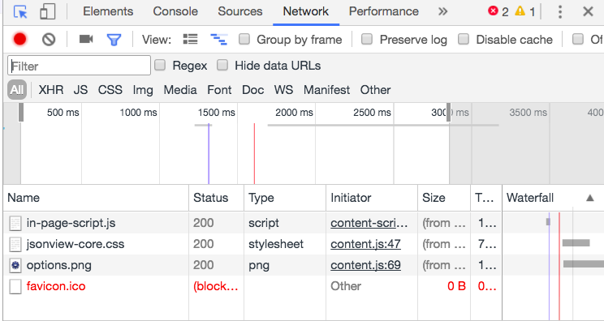
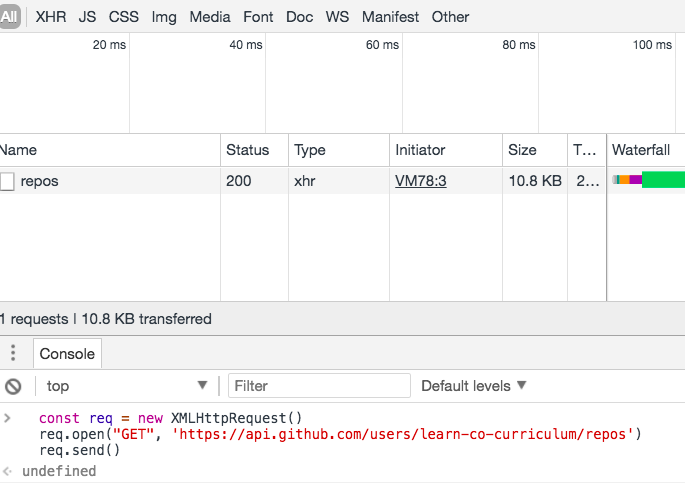

JavaScript XHR
---

### Objectives

1. Explain how JavaScript fetches data from remote resources
2. Explain how XHR helps us write dynamic programs
3. Practice initializing an XHR request
4. Practice handling an XHR response

### Introduction

At this point, you understand that when we wish to retrieve information from a website online, you can type in the url to your browser, and the browser responds with HTML.  Type `www.wikipedia.com` into your browser. When you do, your browser makes a request to one of Wikipedia's computers (known as a server) and the server returns HTML to your computer.  This is known as the request-response cycle.  Upon visiting a url, your computer sends a request for some data, and some other computer connected to the Internet responds with the data.  


Now go to `https://api.github.com/users/learn-co-curriculum/repos`.  Here we are making a request to one of Github's servers and asking for the list of repositories for the learn-co-curriculum user.  You will see that the browser receives JSON back.  JSON is just a string that computers can send across the Internet and is easy to convert into data structures in other languages, like a JavaScript object or a Ruby hash.     

### Viewing the request and response

Our browser allows us to view the request and response - and it's time for us to familiarize ourselves with this.  Open the developer tools by going to the toolbar at the top of Google Chrome.  You want to select "View", then "Developer", then "Developer Tools". 

 

You may also open the console by pressing Cmd+Shift+c (on a Mac) or Ctl+Shift+C (on a PC).  When you open the console, you may see either "Elements" or "Console" highlighted at the top of the developer tools.  Look to the right to find a tab labeled "Network", and click on that.  The network panel likely looks pretty sparse right now, but refresh (by pressing cmd+r or ctl+r) the page, and you'll see some changes.  

 

You'll see a table displaying the requests that your browser makes when you visit the url `https://api.github.com/users/learn-co-curriculum/repos`.  You can even click on a request, on one of the requests, listed under the "Name" column, which will open up a panel displaying information about the request in the "Headers" tab.  Information about the response can be viewed by clicking on either the "Preview" or "Response" tabs.


Those listed requests are for a JavaScript file that apparently the website needs, as well as a css, png, and favicon.ico file.  So after our initial file loads, the HTMl file requests these other files. So there it is.  A mechanism to see information about the request and response cycle through our console.

### Requests and Responses through JavaScript

So just as we can make requests, and receive responses by entering a url into our browser, we can also make requests and responses through our JavaScript code.  Let's see that.  The following code below **will not work** if entered from the `https://api.github.com/users/learn-co-curriculum/repos`, so let's move to a different website, or better yet just open the `index.html` file provided in this repository in Chrome.

Once you do that, move to the "Console" tab in your developer tools.  Then type in the following code:

```js
  const req = new XMLHttpRequest()
  req.open("GET", 'https://api.github.com/users/learn-co-curriculum/repos')
  req.send()
```

Ok, so what we just did is find another mechanism to make a request, this time using JavaScript.  We first initialized a new `XMLHttpRequest` object.  Then we use the `open` method to specify the type of request we wish to send.  We specified a "GET" request, as we are retrieving information about repositories (if we were adding a new repository we would use a POST request), and we specified the url we are making the GET request to.  In the next line we use the `send` method to officially make the request.  

So now open the Developer Tools in this tab, and navigate to the Network tab.  




If you click on the item named repos, more information will be displayed.  There you will find the request that we just made.  We also see the JSON response.


### Tying this to event listeners

We have just seen how to make a request and receive a response using JavaScript.  It happened, the visual evidence is right there in your Developer Tools panel.  This is powerful as we can now listen for events to happen in the console, we can make a request for information online, or update our webpage, and our user would never have to refresh the page.

Unfortunately, right now our user *would* have to open up his developer tools, and go to his network panel to see any of that information.  Not exactly a seamless user experience.  Instead, let's again make the request from the console, and this time listen for an event indicating when our browser received the JSON response.  When that response occurs, we can attach the data to our DOM.  We update our JavaScript code to the following:

```js

let response;
function showRepositories(event, data) {
  //this is set to the XMLHttpRequest object that fired the event
  response = this.responseText
  console.log(response)
}

function getRepositories() {
  const req = new XMLHttpRequest()
  req.addEventListener("load", showRepositories);
  req.open("GET", 'https://api.github.com/users/learn-co-curriculum/repos')
  req.send()
}

getRepositories()
```       

Ok, do you see what is going on here?  Before sending the request, we now listen for the `load` event on the new XMLHttpRequest instance.  When the data is returned to this instance we call the method `showRepositories`.  That function logs the text.  

You may also notice that we declared a global variable called `response` and set that equal to our `responseText` before logging that `responseText`.  We did so, so that we can examine the `responseText` more closely.  Because the responseText is assigned to our `response` variable, which is global, we can take a look at the response text simply by typing `response` in our console.

```js
typeof(response)
// "string"

response

"[
  {
    "id": 87200169,
    "name": "01_hashes_and_internet-lecture-web-040317",
    "full_name": "learn-co-curriculum/01_hashes_and_internet-lecture-web-040317"
  }
  ...
]
"  

```

Ok, so there is quite a lot of text there.  But the main point is that the `responseText` **is a string**.  It looks like a JavaScript array that contains objects, but those quotation marks on either end mean that it is in fact a string.  But wouldn't it be nice if it were an array.  Think about it, the Internet has to send back data in the lowest common denominator.  And whether it is sending back HTML or JSON data, it is sending back a string.  Navigating through data in a string shaped like an object isn't fun.  So let's convert this into an object.

```js
JSON.parse(response)
// [{…}, {…}, {…}, {…}, {…}, {…}, {…}, {…}, {…}, {…}, {…}, {…}, {…}, {…}]

typeof(JSON.parse(response))

// object
```

Ok that did the trick!  `JSON.parse` takes our string shaped like arrays and objects and converts the string into those data structures.  Ok let's update our code:

```js
function showRepositories(event, data) {
  //this is set to the XMLHttpRequest object that fired the event
  response = JSON.parse(this.responseText)
  console.log(response)
}

function getRepositories() {
  const req = new XMLHttpRequest()
  req.addEventListener("load", showRepositories);
  req.open("GET", 'https://api.github.com/users/learn-co-curriculum/repos')
  req.send()
}

getRepositories()
```       


### Tying this to our HTML

Ok, let's finish up by adding to adding an event listener to the link in our HTML.  You'll see the following in the `index.html` file.

```html
<div>
  <h3>Repositories</h3>
  <a href="#">Get Repositories</a>
</div>
```
In our `index.js` file, we should have the following.  First, let's place in the `getRepositories` method again.

```js
  // index.js

  function getRepositories() {
    const req = new XMLHttpRequest()
    req.addEventListener("load", showRepositories);
    req.open("GET", 'https://api.github.com/users/learn-co-curriculum/repos')
    req.send()
  }
```

Then, let's add code to call the `getRepositories` function when the link is clicked.  That's not so bad.

```js
// index.js

document.addEventListener("DOMContentLoaded", function() {
  let link = document.querySelector('a')
  link.addEventListener('click', function(){
    getRepositories()
  })
});

```

Now we need to alter the `showRepositories` function.  

```js
// index.js

function showRepositories(event, data) {
  const repos = JSON.parse(this.responseText)
  const repoLis = repos.map(repo => `<li> ${repo.name} </li>`).join('')
  const repoList = `<ul> ${repoLis} </ul>`
  document.getElementById("repositories").innerHTML = repoList
}
```

Ok, as you can see, our `showRepositories` function now converts the `responseText` into an array of JavaScript objects.  Then our code retrieves the `name` attribute from each of those objects, and places the `name` into an `li` which is set into the HTML.  

## Summary

We learned what the `XMLHttpRequest` object does, how to use it to
request data from a remote resource, and how to handle the response. We
also learned how to parse the `responseText` into JSON and display it on
the page.

## Resources

- [MDN: XMLHttpRequest](https://developer.mozilla.org/en-US/docs/Web/API/XMLHttpRequest)
- [GitHub API](https://developer.github.com/v3/repos/#list-user-repositories)
- [MDN: JSON.Parse](https://developer.mozilla.org/en-US/docs/Web/JavaScript/Reference/Global_Objects/JSON/parse)
- [MDN: Using data attributes](https://developer.mozilla.org/en-US/docs/Web/Guide/HTML/Using_data_attributes)

<p class='util--hide'>View <a href='https://learn.co/lessons/javascript-xhr'>XHR</a> on Learn.co and start learning to code for free.</p>
